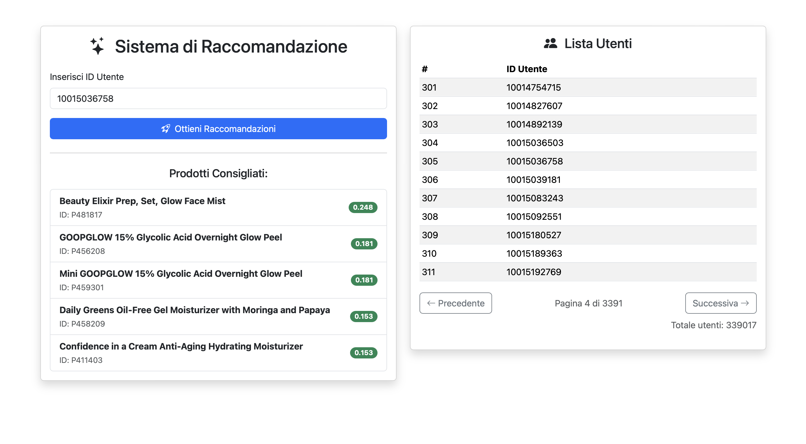

# 🧠 Sistema di Raccomandazione Prodotti

> Applicazione web che consiglia prodotti agli utenti sulla base delle loro valutazioni.  
> Costruita con **FastAPI** (Python) per il backend e **React + Bootstrap** per il frontend, tutto contenuto nella cartella `frontend/`.

---

## 🚀 Funzionalità

- Inserimento manuale dell'**ID utente** per ricevere raccomandazioni personalizzate
- Visualizzazione dei **prodotti consigliati** tramite SVD
- Tabella con oltre **300.000 utenti**, consultabile a pagine
- **Navigazione paginata**, icone **Bootstrap Icons** e UX migliorata
- Indicatore di **caricamento** durante l’elaborazione

---

## 🧱 Struttura del progetto

```
project-root/
│
├── frontend/                       # Contiene sia backend (main.py) che frontend React
│   ├── main.py                     # Backend FastAPI
│   ├── dataset/
│   │   └── archive/
│   │       ├── reviews.csv         # Dataset recensioni
│   │       └── product_info.csv    # Info prodotti
│   ├── public/
│   │   └── index.html              # Root HTML per React
│   ├── src/
│   │   └── App.jsx                 # Interfaccia utente React
│   └── package.json                # Configurazione React
│
└── screenshot.png                  # Immagine dimostrativa dell'app
```

---

## ⚙️ Installazione

### 🐍 Avvio backend + frontend

1. Posizionati nella cartella `frontend/`
2. Crea un ambiente virtuale e installa le dipendenze Python:

```bash
python -m venv venv
source venv/bin/activate  # su Windows: venv\Scripts\activate
pip install fastapi uvicorn pandas scikit-learn
```

3. Avvia il server backend:

```bash
uvicorn main:app --reload
```

Backend attivo su: [http://127.0.0.1:8000](http://127.0.0.1:8000)

4. In un secondo terminale, sempre dentro `frontend/`, installa le dipendenze React:

```bash
npm install
```

5. Avvia il frontend:

```bash
npm run dev
```

Frontend attivo su: [http://localhost:5173](http://localhost:5173)

---

## ✅ Requisiti

- Node.js v18 o superiore
- Python 3.10 o superiore
- File CSV: `reviews.csv` e `product_info.csv` in `frontend/dataset/archive/`

---

## 🖼️ Screenshot


---

## 📄 Licenza

MIT © 2025 - Gianmaria Di Fronzo
# DataIntensiveProject
# DataIntensiveProject
